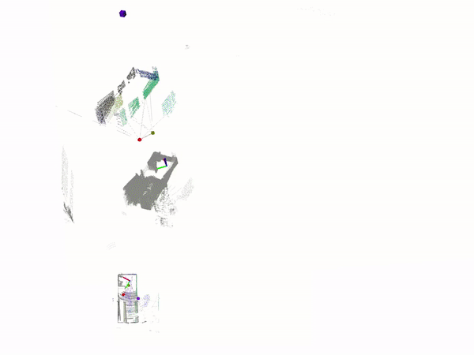
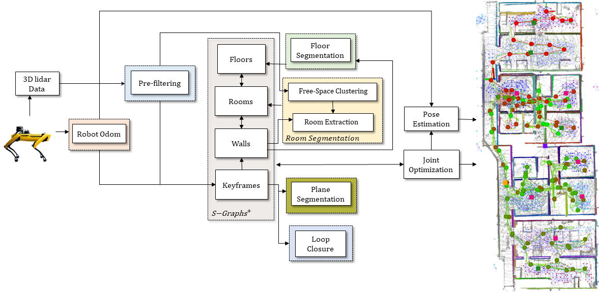
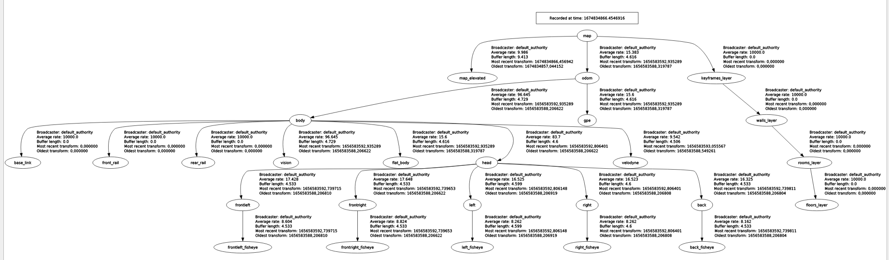

# S-Graphs

**Situational graphs (S-Graphs)** is a ROS package for generating in real-time four-layered hierarchical factor graphs representing a scene graph including **_Keyframes_** registring the robot poses, **_Walls_** which maps wall planes, **_Rooms Layer_** constraining the wall planes using room/infinite_room factors, **_Floors_** constraining the rooms within a given floor level. It also supports several graph constraints, such as GPS, IMU acceleration (gravity vector), IMU orientation (magnetic sensor). We have tested this package with Velodyne (VLP16) sensors in structured indoor environments. This work is a fork of [hdl_graph_slam](https://github.com/koide3/hdl_graph_slam)



## Table of contents

- [Published Papers](#published-papers)
- [About S-Graphs](#about-s-graphs)
  - [Architecture](#architecture)
- [Installation](#installation)
  - [Automated Installation](#automated-installation)
  - [Manual Installation](#manual-installation)
- [Example on Datasets](#example-on-datasets)
  - [Real Dataset](#real-dataset)
  - [Virtual Dataset](#virtual-dataset)
- [Using Docker](#using-docker)
  - [Running Datasets Using Docker](#running-datasets-using-docker)
- [ROS Related](#ros-related)
  - [Nodelets](#nodelets)
  - [Published TFs](#published-tfs)
  - [Services](#services)
  - [Parameters](#parameters)
- [Instructions To Use S-Graphs](#instructions-to-use-s-graphs)
- [License](#license)
- [Maintainers](#maintainers)

## Published Papers

1. [Situational Graphs for Robot Navigation in Structured Indoor Environments
   ](https://arxiv.org/abs/2202.12197)
   - **Citation**
     ```latex
     @misc{bavle2022situational,
           title={Situational Graphs for Robot Navigation in Structured Indoor Environments},
           author={Hriday Bavle and Jose Luis Sanchez-Lopez and Muhammad Shaheer and Javier Civera and Holger Voos},
           year={2022},
           eprint={2202.12197},
           archivePrefix={arXiv},
           primaryClass={cs.RO}
     }
     ```

## About S-Graphs

### Architecture



## Installation

### Automated Installation

1. Create a workspace for S-Graphs

```bash
mkdir -p $Home/s_graphs_ws/src && cd $HOME/s_graphs_ws/src
```

2. Clone the S-Graphs repository into the created workspace

```bash
git clone https://github.com/snt-arg/s_graphs.git
```

3. Run the script setup.sh to install the required dependencies

```bash
cd s_graphs && ./setup.sh
```

### Manual Installation

1. Create a workspace for S-Graphs

```bash
mkdir -p $Home/s_graphs_ws/src && cd $HOME/s_graphs_ws/src
```

2. Clone the S-Graphs repository into the created workspace

```bash
git clone https://github.com/snt-arg/s_graphs.git
```

3. Install the required dependencies using vcstool

```bash
cd s_graphs && vcs import --recursive ../ < .rosinstall
```

4. Install the required ROS packages

```bash
cd ../../ && rosdep install --from-paths src -ignore-src -y
```

5. Build workspace

```bash
catkin build
```

6. Source workspace

```bash
source devel/setup.bash
```

## Example on Datasets

**Note:** For each command below, please execute them in separate terminal windows!

### Real Dataset

```bash
roscd s_graphs && rviz -d rviz/s_graphs.rviz
```

```bash
roslaunch s_graphs s_graphs.launch env:=real use_free_space_graph:=true 2>/dev/null
```

```bash
rosbag PATH_TO_ROSBAG_DATASET --clock
```

### Virtual Dataset

```bash
roscd s_graphs && rviz -d rviz/s_graphs.rviz
```

```bash
roslaunch s_graphs s_graphs.launch env:=virtual use_free_space_graph:=true 2>/dev/null
```

```bash
rosbag play PATH_TO_ROSBAG_DATASET --clock
```

### Dataset only using a Velodyne

```bash
roscd s_graphs && rviz -d rviz/s_graphs.rviz
```

```bash
roslaunch s_graphs s_graphs.launch use_free_space_graph:=true compute_odom:=true 2>/dev/null
```

```bash
rosbag play PATH_TO_ROSBAG_DATASET --clock
```

## Using Docker

A docker image is provided with s_graphs. This image is all set and is just pull and play. Follow the instructions below in order to use s_graphs via docker.

1. Pull the docker image from DockerHub

```bash
docker pull sntarg/s_graphs:latest
```

2. Create a container for the s_graphs image.

```bash
docker run -dit --net host --name s_graphs_container sntarg/s_graphs
```

This command also incorporates the flags `d`, which makes the container run in the detached mode and `net`, which gives the container the access of the host interfaces.

3. Execute the container

```bash
docker exec -ti s_graphs_container bash
```

4. Source the s_graphs worspace

```bash
source devel/setup.bash
```

**Note:** Once the worspace is sourced once, it will no longer be required to resourced it again.

### Running Datasets using docker

In order to run datasets using docker, one just needs to use the command `roslaunch s_graphs s_graphs.launch use_free_space_graph:=true env:=virtual 2>/dev/null` inside docker.
The other 2 commands should be executed outside docker. Additionally, the `env` parameter should be changed accordingly to the type of dataset.

## ROS Related

### Nodelets

> s_graphs is composed of **3** main nodelets.

- **s_graphs_nodelet**

  - Subscribed Topics

    - `/odom` ([nav_msgs/Odometry](http://docs.ros.org/en/noetic/api/nav_msgs/html/msg/Odometry.html))
      - The odometry from the robot.
    - `/filtered_points` ([sensor_msgs/PointCloud2](http://docs.ros.org/en/melodic/api/sensor_msgs/html/msg/PointCloud2.html))
      - The data from the Lidar sensor.

  - Published Topics

    - `/s_graphs/markers` ([visualization_msgs/MarkerArray](http://docs.ros.org/en/noetic/api/visualization_msgs/html/msg/MarkerArray.html))
      - The markers represents the different s_graphs layers.
    - `/s_graphs/odom2map` ([geometry_msgs/TransformStamped](http://docs.ros.org/en/api/geometry_msgs/html/msg/TransformStamped.html))
      - Sets where the robot pose is within the map (world).
    - `/s_graphs/odom_pose_corrected` ([geometry_msgs/PoseStamped](http://docs.ros.org/en/noetic/api/geometry_msgs/html/msg/PoseStamped.html))
      - The pose of the robot once odom2map is applied.
    - `/s_graphs/odom_path_corrected` ([nav_msgs/Path](http://docs.ros.org/en/noetic/api/nav_msgs/html/msg/Path.html))

      - The path of the robot once the odom2map is applied.

    - `/s_graphs/map_points` ([sensor_msgs/PointCloud2](http://docs.ros.org/en/melodic/api/sensor_msgs/html/msg/PointCloud2.html))
      - The points that represent the first layer of S-Graphs.
    - `/s_graphs/map_planes` (s_graphs/PlanesData)
      - Current planes seen by the robot.
    - `/s_graphs/all_map_planes` (s_graphs/PlanesData)
      - All the planes that were seen by the robot.

- **room_segmentation_nodelet**

  - Subscribed Topics

    - `/voxblox_skeletonizer/sparse_graph` ([visualization_msgs/MarkerArray](http://docs.ros.org/en/noetic/api/visualization_msgs/html/msg/MarkerArray.html))
      - Represents the free space where the robot can go to. This is also knonw as free-space clusters.
    - `/s_graphs/map_planes` (s_graphs/PlanesData)
      - Current planes seen by the robot.

  - Published Topics

    - `/room_segmentation/room_data` (s_graphs/RoomsData)
      - Contains all the necessary information about the rooms in a floor.

- **floor_plane_nodelet**

  - Subscribed Topics

    - `/s_graphs/all_map_planes` ([visualization_msgs/MarkerArray](http://docs.ros.org/en/noetic/api/visualization_msgs/html/msg/MarkerArray.html))
      - All the planes that were seen by the robot.

  - Published Topics

    - `/floor_plan/floor_data` (s_graphs/RoomData):
      - Constains all the necessary information about each floor.

### Services

- `/s_graphs/dump` (s_graphs/DumpGraph)

  - save all the internal data (point clouds, floor coeffs, odoms, and pose graph) to a directory.

- `/s_graphs/save_map` (s_graphs/SaveMap)
  - save the generated map as a PCD file.

### Parameters

All the configurable parameters are listed in _launch/s_graphs.launch_ as ros params.

### Published TFs

- `map2odom`: The transform published between the map frame and the odom frame after the corrections have been applied.



## Instructions To Use S-Graphs

1. Define the transformation between your sensors (LIDAR, IMU, GPS) and base_link of your system using static_transform_publisher (see line #94, s_graphs.launch). All the sensor data will be transformed into the common `base_link` frame, and then fed to the SLAM algorithm. Note: `base_link` frame in virtual dataset is set to `base_footprint` and in real dataset is set to `body`

2. Remap the point cloud topic of **_PrefilteringNodelet_**. Like:

```xml
  <node pkg="nodelet" type="nodelet" name="hdl_prefilter" args="load s_graphs/PrefilteringNodelet hdl_prefilter_nodelet_manager">
    <remap from="/velodyne_points" to="/rslidar_points"/>
  ...
```

3. If you have an odometry source convert it to base ENU frame, then remove the **_ScanMatchingNodelet_** from line #37 to #50 in `s_graphs.launch` and then remap odom topic in **_SGraphsNodelet_** like

```xml
  <node pkg="nodelet" type="nodelet" name="s_graphs" args="load s_graphs/SGraphsNodelet s_graphs_nodelet_manager" output="screen">
    <remap if="$(eval arg('env') == 'real')" from="/odom" to="/platform/odometry" />
  ...
```

Note: If you want to visualize the tfs correctly then your odom source must provide a tf from the `odom` to `base_link` frame.

## License

This package is released under the **BSD-2-Clause** License.

Note that the cholmod solver in g2o is licensed under GPL. You may need to build g2o without cholmod dependency to avoid the GPL.

## Maintainers

- <ins>**Hriday Bavle**</ins>
  - **Email:** hriday.bavle@uni.lu
  - **Website:** https://www.hriday.bavle.com/
- <ins>**Muhammad Shaheer**</ins>
  - **Email:** muhamad.shaheer@uni.lu
- <ins>**Pedro Soares**</ins>
  - **Email:** pedro.soares@uni.lu
