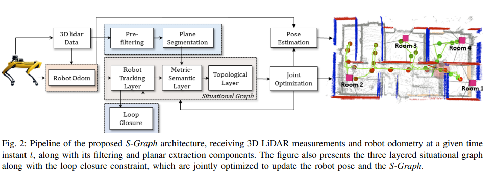

# S-Graphs

**Situational graphs (S-Graphs)** is a ROS package for generating in real-time three-layered hierarchical factor graphs representing a scene graph including the lowest **_Robot Tracking Layer_** registring the robot poses, **_Metric-Semantic Layer_** which maps planar features and **_Topological Layer_** constraining the planar features using room/corridor factors. It also supports several graph constraints, such as GPS, IMU acceleration (gravity vector), IMU orientation (magnetic sensor). We have tested this package with Velodyne (VLP16) sensors in structured indoor environments. This work is a fork of [hdl_graph_slam](https://github.com/koide3/hdl_graph_slam)

[](https://www.youtube.com/watch?v=eoWrBTY04Oc)

## Table of contents

- [Published Papers](#published-papers)
- [About S-Graphs](#about-s-graphs)
  - [Architecture](#architecture)
- [Installation](#installation)
  - [Automated Installation](#automated-installation)
  - [Manual Installation](#manual-installation)
- [Example on Datasets](#example-on-datasets)
  - [Real Dataset](#real-dataset)
  - [Virtual Dataset](#virtual-dataset)
- [Using Docker](#using-docker)
  - [Running Datasets Using Docker](#running-datasets-using-docker)
- [ROS Related](#ros-related)
  - [Nodelets](#nodelets)
  - [Subscribed Topics](#subscribed-topics)
  - [Published Topics](#published-topics)
  - [Published TFs](#published-tfs)
  - [Services](#services)
  - [Parameters](#parameters)
- [Instructions](#instructions)
- [License](#license)
- [Related Packages](#related-packages)
- [Contact](#contact)

## Published Papers

1. [Situational Graphs for Robot Navigation in Structured Indoor Environments
   ](https://arxiv.org/abs/2202.12197)
   - **Citation**
     ```latex
     @misc{bavle2022situational,
           title={Situational Graphs for Robot Navigation in Structured Indoor Environments},
           author={Hriday Bavle and Jose Luis Sanchez-Lopez and Muhammad Shaheer and Javier Civera and Holger Voos},
           year={2022},
           eprint={2202.12197},
           archivePrefix={arXiv},
           primaryClass={cs.RO}
     }
     ```

## About S-Graphs

### Architecture



## Constraints (Edges)

You can enable/disable each constraint by changing params in the launch file, and you can also change the weight (\*\_stddev) and the robust kernel (\*\_robust_kernel) of each constraint.

- **_Odometry_**

- **_Planar_**
  - _segmented_clouds_ (vector of sensor_msgs/PointCloud)

This constraint maps the vertical and horizontal planar surfaces using the planar surfaces detected from the _plane_extraction_nodelet_.

- **_Room/Corridor_**

This constraint parses the mapped vertical planar surfaces to further detect rooms and corridors and create their respective node with edges connecting the room/corridor node with corresponding planar surfaces.

- **_Loop closure_**

- **_GPS_**
  - _/gps/geopoint_ (geographic_msgs/GeoPointStamped)
  - _/gps/navsat_ (sensor_msgs/NavSatFix)
  - _/gpsimu_driver/nmea_sentence_ (nmea_msgs/Sentence)

s*graphs supports several GPS message types. All the supported types contain (latitude, longitude, and altitude). s_graphs converts them into [the UTM coordinate](http://wiki.ros.org/geodesy), and adds them into the graph as 3D position constraints. If altitude is set to NaN, the GPS data is treated as a 2D constrait. GeoPoint is the most basic one, which consists of only (lat, lon, alt). Although NavSatFix provides many information, we use only (lat, lon, alt) and ignore all other data. If you're using HDL32e, you can directly connect \_s_graphs* with _velodyne_driver_ via _/gpsimu_driver/nmea_sentence_.

- **_IMU acceleration (gravity vector)_**
  - _/gpsimu_driver/imu_data_ (sensor_msgs/Imu)

This constraint rotates each pose node so that the acceleration vector associated with the node becomes vertical (as the gravity vector). This is useful to compensate for accumulated tilt rotation errors of the scan matching. Since we ignore acceleration by sensor motion, you should not give a big weight for this constraint.

- **_IMU orientation (magnetic sensor)_**

  - _/gpsimu_driver/imu_data_ (sensor_msgs/Imu)

  If your IMU has a reliable magnetic orientation sensor, you can add orientation data to the graph as 3D rotation constraints. Note that, magnetic orientation sensors can be affected by external magnetic disturbances. In such cases, this constraint should be disabled.

## Installation

### Automated Installation

1. Create a workspace for S-Graphs

```bash
mkdir -p $Home/s_graphs_ws/src && cd $HOME/s_graphs_ws/src
```

2. Clone the S-Graphs repository into the created workspace

```bash
git clone https://github.com/snt-arg/s_graphs.git
```

3. Run the script setup.sh to install the required dependencies

```bash
cd s_graphs && ./setup.sh
```

### Manual Installation

1. Create a workspace for S-Graphs

```bash
mkdir -p $Home/s_graphs_ws/src && cd $HOME/s_graphs_ws/src
```

2. Clone the S-Graphs repository into the created workspace

```bash
git clone https://github.com/snt-arg/s_graphs.git
```

3. Install the required dependencies using vcstool

```bash
cd s_graphs && vcs import --recursive ../ < .rosinstall
```

4. Install the required ROS packages

```bash
cd ../../ && rosdep install --from-paths src -ignore-src -y
```

5. Build workspace

```bash
catkin build
```

6. Source workspace

```bash
source devel/setup.bash
```

## Example on Datasets

**Note:** For each command below, please executed them in separate terminal windows!

### Real Dataset

```bash
roscd s_graphs && rviz -d rviz/s_graphs.rviz
```

```bash
roslaunch s_graphs s_graphs.launch use_free_space_graph:=true 2>/dev/null
```

```bash
rosbag PATH_TO_ROSBAG_DATASET --clock
```

### Virtual Dataset

```bash
roscd s_graphs && rviz -d rviz/s_graphs.rviz
```

```bash
roslaunch s_graphs s_graphs.launch use_free_space_graph:=true env:=virtual 2>/dev/null
```

```bash
rosbag play PATH_TO_ROSBAG_DATASET --clock
```

## Using Docker

A docker image is provided with s_graphs. This image is all set and is just pull and play. Follow the instructions below in order to use s_graphs via docker.

1. Pull the docker image from DockerHub

```bash
docker pull pedros235/s_graphs:latest
```

2. Create a container for the s_graphs image.

```bash
docker run -dit --net host --name s_graphs_container s_graphs
```

This command also incorporates the flags `d`, which makes the container run in the detached mode and `net`, which gives the container the access of the host interfaces.

3. Execute the container

```bash
docker exec -ti s_graphs_container bash
```

4. Source the s_graphs worspace

```bash
source devel/setup.bash
```

**Note:** Once the worspace is sourced once, it will no longer be required to resourced it again.

### Running Datasets using docker

In order to run datasets using docker, one just needs to use the command `roslaunch s_graphs s_graphs.launch use_free_space_graph:=true env:=virtual 2>/dev/null` inside docker.
The other 2 commands should be executed outside docker. Additionally, the `env` parameter should be changed accordingly to the type of dataset.

<!-- ## Example1 (Indoor)

Bag file (recorded in a small room):

- [hdl_501.bag.tar.gz](http://www.aisl.cs.tut.ac.jp/databases/s_graphs/hdl_501.bag.tar.gz) (raw data, 344MB)
- [hdl_501_filtered.bag.tar.gz](http://www.aisl.cs.tut.ac.jp/databases/s_graphs/hdl_501_filtered.bag.tar.gz) (downsampled data, 57MB, **Recommended!**)

```bash
rosparam set use_sim_time true
roslaunch s_graphs s_graphs_501.launch
```

```bash
roscd s_graphs/rviz
rviz -d s_graphs.rviz
```

```bash
rosbag play --clock hdl_501_filtered.bag
```

We also provide bag_player.py which adjusts the playback speed according to the processing speed. It allows to process data as fast as possible.

```bash
rosrun s_graphs bag_player.py hdl_501_filtered.bag
```

You'll see a point cloud like:

 

You can save the generated map by:
```bash
rosservice call /s_graphs/save_map "resolution: 0.05
destination: '/full_path_directory/map.pcd'"
```

## Example2 (Outdoor)

Bag file (recorded in an outdoor environment):
- [hdl_400.bag.tar.gz](http://www.aisl.cs.tut.ac.jp/databases/s_graphs/hdl_400.bag.tar.gz) (raw data, about 900MB)

```bash
rosparam set use_sim_time true
roslaunch s_graphs s_graphs_400.launch
```

```bash
roscd s_graphs/rviz
rviz -d s_graphs.rviz
```

```bash
rosbag play --clock hdl_400.bag
```

 

## Example with GPS
Ford Campus Vision and Lidar Data Set [\[URL\]](http://robots.engin.umich.edu/SoftwareData/Ford)

The following script converts the Ford Lidar Dataset to a rosbag and plays it. In this example, ***s_graphs*** utilizes the GPS data to correct the pose graph.

```bash
cd IJRR-Dataset-2
rosrun s_graphs ford2bag.py dataset-2.bag
rosrun s_graphs bag_player.py dataset-2.bag
```

   -->

## ROS Related

### Nodelets

**S-Graphs** consists of four nodelets.

- `s_graphs_nodelet`
- `s_graphs_floor_plan_nodelet_manager`
- `s_graphs_floor_planner_nodelet`
- `s_graphs_nodelet_manager`
- `s_graphs_room_seg_nodelet_manager`
- `s_graphs_room_segmentor_nodelet`
- `hdl_prefilter_nodelet`
- `hdl_prefilter_nodelet_manager`

<!-- The input point cloud is first downsampled by _prefiltering_nodelet_, and then passed to the next nodelets. While _scan_matching_odometry_nodelet_ (optional module and can be replaced by an other odometry module) estimates the sensor pose by iteratively applying a scan matching between consecutive frames (i.e., odometry estimation), _plane_segmentation_nodelet_ detects vertical and horizontal planes by RANSAC. The estimated odometry and the planes are sent to _s_graphs_. To compensate the accumulated error of the scan matching, it performs loop detection and optimizes a pose graph which takes various constraints into account. -->

### Subscribed Topics

- `/s_graphs_nodelet_manager/bond`([bond/status](http://docs.ros.org/en/noetic/api/bond/html/msg/Status.html))
- /clock

### Published Topics

- `/s_graphs_nodelet_manager/bond`([bond/status](http://docs.ros.org/en/noetic/api/bond/html/msg/Status.html))

### Published TFs

Here comes the different published tfs

### Services

- `/s_graphs/dump` (s_graphs/DumpGraph)

  - save all the internal data (point clouds, floor coeffs, odoms, and pose graph) to a directory.

- `/s_graphs/save_map` (s_graphs/SaveMap)
  - save the generated map as a PCD file.

### Parameters

All the configurable parameters are listed in _launch/s_graphs.launch_ as ros params.

## Instructions

1. Define the transformation between your sensors (LIDAR, IMU, GPS) and base_link of your system using static_transform_publisher (see line #11, s_graphs.launch). All the sensor data will be transformed into the common base_link frame, and then fed to the SLAM algorithm.

2. Remap the point cloud topic of **_prefiltering_nodelet_**. Like:

```xml
  <node pkg="nodelet" type="nodelet" name="prefiltering_nodelet" ...
    <remap from="/velodyne_points" to="/rslidar_points"/>
  ...
```

## License

This package is released under the **BSD-2-Clause** License.

Note that the cholmod solver in g2o is licensed under GPL. You may need to build g2o without cholmod dependency to avoid the GPL.

## Related packages

- [interactive_slam](https://github.com/koide3/interactive_slam)
- [hdl_localization](https://github.com/koide3/hdl_localization)
- [hdl_people_tracking](https://github.com/koide3/hdl_people_tracking)

## Contact

- <ins>**Hriday Bavle**</ins>
  - **Email:** hriday.bavle@uni.lu
  - **Website:** https://www.hriday.bavle.com/
- <ins>**Muhammad Shaheer**</ins>
  - **Email:** muhamad.shaheer@uni.lu
