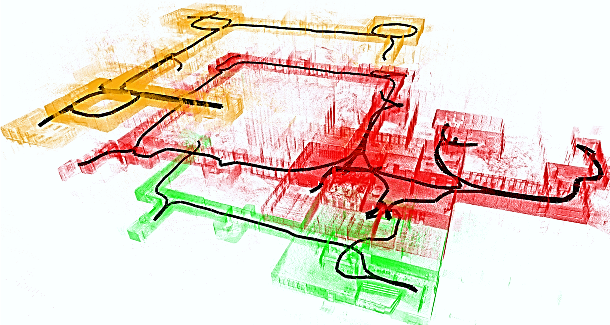

 <h1>LiDAR S-Graphs</h1>

**LiDAR Situational Graphs (S-Graphs)** is a ROS2 package for generating in real-time four-layered hierarchical factor graphs for single or multi-floor scenes. It reepresents a scene graph using 3D LiDAR which includes **_Keyframes_** registring the robot poses, **_Walls_** which map wall planes, **_Rooms Layer_** constraining the wall planes using 4 wall-room or 2 wall-room factors, **_Floors_** constraining the rooms within a given floor level. It also supports several graph constraints, such as GPS, IMU acceleration (gravity vector), IMU orientation (magnetic sensor). We have tested this package mostly with Ouster OS-1 and Velodyne (VLP16) sensors in structured indoor environments. 

  

## 📖 Published Papers 

    
<a href="https://arxiv.org/abs/2212.11770">S-Graphs+: Real-time Localization and Mapping leveraging Hierarchical Representations </a>
    

    @ARTICLE{10168233,
     author={Bavle, Hriday and Sanchez-Lopez, Jose Luis and Shaheer, Muhammad and Civera, Javier and Voos, Holger},
     journal={IEEE Robotics and Automation Letters},
     title={S-Graphs+: Real-Time Localization and Mapping Leveraging Hierarchical Representations},
     year={2023},
     volume={8},
     number={8},
     pages={4927-4934},
     doi={10.1109/LRA.2023.3290512}}

    
<a href="https://arxiv.org/abs/2202.12197">Situational Graphs for Robot Navigation in Structured Indoor Environments</a>

      @ARTICLE{9826367,
        author={Bavle, Hriday and Sanchez-Lopez, Jose Luis and Shaheer, Muhammad and Civera, Javier and Voos, Holger},
        journal={IEEE Robotics and Automation Letters},
        title={Situational Graphs for Robot Navigation in Structured Indoor Environments},
        year={2022},
        volume={7},
        number={4},
        pages={9107-9114},
        doi={10.1109/LRA.2022.3189785}}

## Documentation

For installation refer to the documentation available [here](https://snt-arg.github.io/lidar_situational_graphs)
