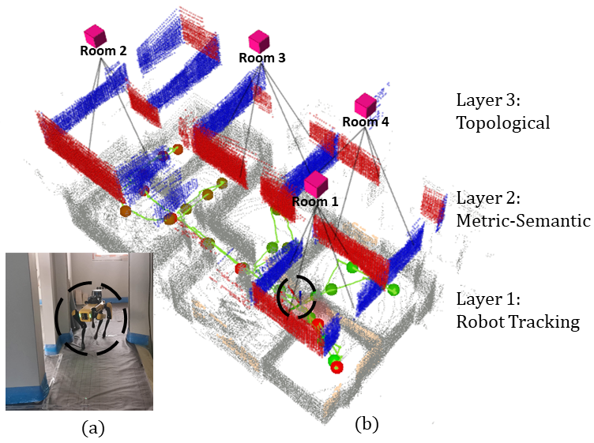

# S-Graphs
**Situational graphs (S-Graphs)** is a ROS package for generating in real-time three-layered hierarchical factor graphs including the lowest ***Robot Tracking Layer*** registring the robot poses, ***Metric-Semantic Layer*** which maps planar features and ***Topological Layer*** constraining the planar features using room/corridor factors. It also supports several graph constraints, such as GPS, IMU acceleration (gravity vector), IMU orientation (magnetic sensor). We have tested this package with Velodyne (VLP16) sensors in structured indoor environments. This work is a fork of [HDL_GRAPH_SLAM](https://github.com/koide3/hdl_graph_slam)


[](https://www.youtube.com/watch?v=eoWrBTY04Oc)

## Paper

```latex
@misc{bavle2022situational,
      title={Situational Graphs for Robot Navigation in Structured Indoor Environments}, 
      author={Hriday Bavle and Jose Luis Sanchez-Lopez and Muhammad Shaheer and Javier Civera and Holger Voos},
      year={2022},
      eprint={2202.12197},
      archivePrefix={arXiv},
      primaryClass={cs.RO}
}
```

## Nodelets
**S-Graphs** consists of four nodelets.

- *prefiltering_nodelet*
- *scan_matching_odometry_nodelet*
- *plane_segmentation_nodelet*
- *s_graphs_nodelet*

The input point cloud is first downsampled by *prefiltering_nodelet*, and then passed to the next nodelets. While *scan_matching_odometry_nodelet* (optional module and can be replaced by an other odometry module) estimates the sensor pose by iteratively applying a scan matching between consecutive frames (i.e., odometry estimation), *plane_segmentation_nodelet* detects vertical and horizontal planes by RANSAC. The estimated odometry and the planes are sent to *s_graphs*. To compensate the accumulated error of the scan matching, it performs loop detection and optimizes a pose graph which takes various constraints into account.

## Constraints (Edges)

You can enable/disable each constraint by changing params in the launch file, and you can also change the weight (\*_stddev) and the robust kernel (\*_robust_kernel) of each constraint.

- ***Odometry***


- ***Planar***
  - *segmented_clouds* (vector of sensor_msgs/PointCloud)

This constraint maps the vertical and horizontal planar surfaces using the planar surfaces detected from the *plane_extraction_nodelet*. 

- ***Room/Corridor***

This constraint parses the mapped vertical planar surfaces to further detect rooms and corridors and create their respective node with edges connecting the room/corridor node with corresponding planar surfaces. 

- ***Loop closure***

- ***GPS***
  - */gps/geopoint* (geographic_msgs/GeoPointStamped)
  - */gps/navsat* (sensor_msgs/NavSatFix)
  - */gpsimu_driver/nmea_sentence* (nmea_msgs/Sentence)

s_graphs supports several GPS message types. All the supported types contain (latitude, longitude, and altitude). s_graphs converts them into [the UTM coordinate](http://wiki.ros.org/geodesy), and adds them into the graph as 3D position constraints. If altitude is set to NaN, the GPS data is treated as a 2D constrait. GeoPoint is the most basic one, which consists of only (lat, lon, alt). Although NavSatFix provides many information, we use only (lat, lon, alt) and ignore all other data. If you're using HDL32e, you can directly connect *s_graphs* with *velodyne_driver* via */gpsimu_driver/nmea_sentence*.

- ***IMU acceleration (gravity vector)***
  - */gpsimu_driver/imu_data* (sensor_msgs/Imu)

This constraint rotates each pose node so that the acceleration vector associated with the node becomes vertical (as the gravity vector). This is useful to compensate for accumulated tilt rotation errors of the scan matching. Since we ignore acceleration by sensor motion, you should not give a big weight for this constraint.

- ***IMU orientation (magnetic sensor)***
  - */gpsimu_driver/imu_data* (sensor_msgs/Imu)

  If your IMU has a reliable magnetic orientation sensor, you can add orientation data to the graph as 3D rotation constraints. Note that, magnetic orientation sensors can be affected by external magnetic disturbances. In such cases, this constraint should be disabled.


## Parameters
All the configurable parameters are listed in *launch/s_graphs.launch* as ros params.

## Services
- */s_graphs/dump*  (s_graphs/DumpGraph)
  - save all the internal data (point clouds, floor coeffs, odoms, and pose graph) to a directory.
- */s_graphs/save_map*  (s_graphs/SaveMap)
  - save the generated map as a PCD file.

## Requirements
***s_graphs*** requires the following libraries:

- OpenMP
- PCL
- g2o
- suitesparse

The following ROS packages are required:

- geodesy
- nmea_msgs
- pcl_ros
- [ndt_omp](https://github.com/koide3/ndt_omp)
- [fast_gicp](https://github.com/SMRT-AIST/fast_gicp)

```bash
# for melodic
sudo apt-get install ros-melodic-geodesy ros-melodic-pcl-ros ros-melodic-nmea-msgs ros-melodic-libg2o
# for noetic
sudo apt-get install ros-noetic-geodesy ros-noetic-pcl-ros ros-noetic-nmea-msgs ros-noetic-libg2o

cd catkin_ws/src
git clone https://github.com/koide3/ndt_omp.git
git clone https://github.com/SMRT-AIST/fast_gicp.git --recursive
```

**[optional]** *bag_player.py* script requires ProgressBar2.
```bash
sudo pip install ProgressBar2
```

<!-- ## Example1 (Indoor)

Bag file (recorded in a small room):

- [hdl_501.bag.tar.gz](http://www.aisl.cs.tut.ac.jp/databases/s_graphs/hdl_501.bag.tar.gz) (raw data, 344MB)
- [hdl_501_filtered.bag.tar.gz](http://www.aisl.cs.tut.ac.jp/databases/s_graphs/hdl_501_filtered.bag.tar.gz) (downsampled data, 57MB, **Recommended!**)

```bash
rosparam set use_sim_time true
roslaunch s_graphs s_graphs_501.launch
```

```bash
roscd s_graphs/rviz
rviz -d s_graphs.rviz
```

```bash
rosbag play --clock hdl_501_filtered.bag
```

We also provide bag_player.py which adjusts the playback speed according to the processing speed. It allows to process data as fast as possible.

```bash
rosrun s_graphs bag_player.py hdl_501_filtered.bag
```

You'll see a point cloud like:

 

You can save the generated map by:
```bash
rosservice call /s_graphs/save_map "resolution: 0.05
destination: '/full_path_directory/map.pcd'"
```

## Example2 (Outdoor)

Bag file (recorded in an outdoor environment):
- [hdl_400.bag.tar.gz](http://www.aisl.cs.tut.ac.jp/databases/s_graphs/hdl_400.bag.tar.gz) (raw data, about 900MB)

```bash
rosparam set use_sim_time true
roslaunch s_graphs s_graphs_400.launch
```

```bash
roscd s_graphs/rviz
rviz -d s_graphs.rviz
```

```bash
rosbag play --clock hdl_400.bag
```

 

## Example with GPS
Ford Campus Vision and Lidar Data Set [\[URL\]](http://robots.engin.umich.edu/SoftwareData/Ford)

The following script converts the Ford Lidar Dataset to a rosbag and plays it. In this example, ***s_graphs*** utilizes the GPS data to correct the pose graph.

```bash
cd IJRR-Dataset-2
rosrun s_graphs ford2bag.py dataset-2.bag
rosrun s_graphs bag_player.py dataset-2.bag
```

   -->

## Use S-Graphs on your system

1. Define the transformation between your sensors (LIDAR, IMU, GPS) and base_link of your system using static_transform_publisher (see line #11, s_graphs.launch). All the sensor data will be transformed into the common base_link frame, and then fed to the SLAM algorithm.

2. Remap the point cloud topic of ***prefiltering_nodelet***. Like:

```bash
  <node pkg="nodelet" type="nodelet" name="prefiltering_nodelet" ...
    <remap from="/velodyne_points" to="/rslidar_points"/>
  ...
```
<!-- 
## Common Problems -->

<!-- ### Parameter tuning guide

The mapping result deeply depends on the parameter setting. In particular, scan matching parameters have a big impact on the result. Tune the parameters accoding to the following instruction:

- ***registration_method***
   **In short, use GICP for 16-line LIDARs and NDT_OMP for other ones**.  This parameter allows to change the registration method to be used for odometry estimation and loop detection. If you use a LIDAR with many scan lines (32, 64, or more lines), NDT_OMP could be a good choice. It is fast and accurate for dense point clouds. If you use a 16-line LIDAR, NDT-based methods may not work well because it is not very robust to sparse point clouds. In that case, choose GICP or GICP_OMP. GICP variants are slightly slower than NDT, but more accurate and robust to sparse point clouds.
  Note that GICP in PCL1.7 (ROS kinetic) or earlier has a bug in the initial guess handling. **If you are on ROS kinectic or earlier, do not use GICP**.

- ***ndt_resolution***
  This parameter decides the voxel size of NDT. Typically larger values are good for outdoor environements (0.5 - 2.0 [m] for indoor, 2.0 - 10.0 [m] for outdoor). If you chose NDT or NDT_OMP, tweak this parameter so you can obtain a good odometry estimation result.

- ***other parameters***
  All the configurable parameters are available in the launch file. Copy a template launch file (s_graphs_501.launch for indoor, s_graphs_400.launch for outdoor) and tweak parameters in the launch file to adapt it to your application. -->

## License

This package is released under the BSD-2-Clause License.


Note that the cholmod solver in g2o is licensed under GPL. You may need to build g2o without cholmod dependency to avoid the GPL.

<!-- ## Related packages

- [interactive_slam](https://github.com/koide3/interactive_slam)
- [s_graphs](https://github.com/koide3/s_graphs)
- [hdl_localization](https://github.com/koide3/hdl_localization)
- [hdl_people_tracking](https://github.com/koide3/hdl_people_tracking)

 -->

<!-- ## Contact
Kenji Koide, k.koide@aist.go.jp, https://staff.aist.go.jp/k.koide

Active Intelligent Systems Laboratory, Toyohashi University of Technology, Japan [\[URL\]](http://www.aisl.cs.tut.ac.jp)  
Mobile Robotics Research Team, National Institute of Advanced Industrial Science and Technology (AIST), Japan  [\[URL\]](https://unit.aist.go.jp/rirc/en/team/smart_mobility.html) -->
