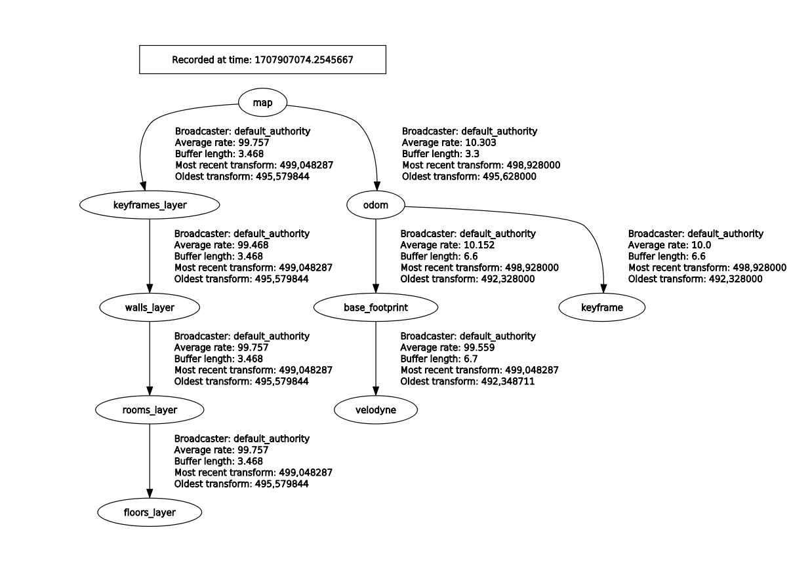

# S-Graphs

**Situational graphs (S-Graphs)** is a ROS2 package for generating in real-time four-layered hierarchical factor graphs representing a scene graph including **_Keyframes_** registring the robot poses, **_Walls_** which map wall planes, **_Rooms Layer_** constraining the wall planes using 4 wall-room or 2 wall-room factors, **_Floors_** constraining the rooms within a given floor level. It also supports several graph constraints, such as GPS, IMU acceleration (gravity vector), IMU orientation (magnetic sensor). We have tested this package mostly with Velodyne (VLP16) sensors in structured indoor environments. This work is a fork of [hdl_graph_slam](https://github.com/koide3/hdl_graph_slam) which as previously in ROS1.

<p align="center">
  <a href="">
    
  </a>
</p>

## 📜 Table of contents

- [📖 Published Papers](#published-papers)
- [⚙️ Installation](#installation)
  - [📦 Installation From Source](#installation-from-source)
    - [1️⃣ Installation on ROS2](#installation-on-ros2)
    - [2️⃣ Download ROS bridge](#download-ros-bridge)
    - [3️⃣ Installation on ROS1](#installation-on-ros2)
- [🧪 Unit Tests](#unit-tests)
- [🐳 Docker](#docker)
- [🚀 Usage](#usage)
  - [Run S_Graphs On Your Data](#run-s_graphs-on-your-data)
  - [Example on Datasets](#example-on-datasets)
  - [Running S_Graphs with Docker](#running-s_graphs-with-docker)
- [🤖 ROS Related](#ros-related)
  - [📥 Subscribed Topics](#subscribed-topics)
  - [📤 Published Topics](#published-topics)
  - [🔄 ROS Services](#ros-services)
  - [⚙️ ROS Parameters](#ros-parameters)
  - [🌐 Published TFs](#published-tfs)

## 📖 Published Papers <a id="published-papers"></a>

<details >
    <summary><a href="https://arxiv.org/abs/2212.11770">S-Graphs+: Real-time Localization and Mapping leveraging Hierarchical Representations </a>
    </summary>

    @ARTICLE{10168233,
     author={Bavle, Hriday and Sanchez-Lopez, Jose Luis and Shaheer, Muhammad and Civera, Javier and Voos, Holger},
     journal={IEEE Robotics and Automation Letters},
     title={S-Graphs+: Real-Time Localization and Mapping Leveraging Hierarchical Representations},
     year={2023},
     volume={8},
     number={8},
     pages={4927-4934},
     doi={10.1109/LRA.2023.3290512}}

</details>
<details>
    <summary><a href="https://arxiv.org/abs/2202.12197">Situational Graphs for Robot Navigation in Structured Indoor Environments</a></summary>

      @ARTICLE{9826367,
        author={Bavle, Hriday and Sanchez-Lopez, Jose Luis and Shaheer, Muhammad and Civera, Javier and Voos, Holger},
        journal={IEEE Robotics and Automation Letters},
        title={Situational Graphs for Robot Navigation in Structured Indoor Environments},
        year={2022},
        volume={7},
        number={4},
        pages={9107-9114},
        doi={10.1109/LRA.2022.3189785}}

</details>

## ⚙️ Installation <a id="installation"></a>

<!-- TODO: When s-graphs is available in rosdistro add here the command to install -->

> [!NOTE]
> S-Graphs+ was only tested on Ubuntu 20.04, with ROS1 Noetic and ROS2 Foxy distro.

### 📦 Installation From Source <a id="installation-from-source"></a>

The installation consists of 2 parts. One for ROS1 and another for ROS2. You can
use just the ROS2 version, however it will not be working to it's full potential.

> [!IMPORTANT]
> Before proceeding, make sure you have `rosdep` installed. You can install it using `sudo apt-get install python3-rosdep`
> In addition, ssh keys are needed to be configured on you GitHub account. If you haven't
> yet configured ssh keys, follow this [tutorial](https://docs.github.com/en/authentication/connecting-to-github-with-ssh/generating-a-new-ssh-key-and-adding-it-to-the-ssh-agent)

#### 1️⃣ Installation on ROS2 <a id="installation-on-ros2"></a>

1. Update Rosdep:

```sh
rosdep init && rosdep update --include-eol-distros
```

2. Create a ROS2 workspace for S-Graphs

```bash
mkdir -p $HOME/workspaces/s_graphs_ros2_ws/src && cd $HOME/workspaces/s_graphs_ros2_ws/src && source /opt/ros/foxy/setup.bash
```

3. Clone the S-Graphs repository into the created workspace

```bash
git clone https://github.com/snt-arg/s_graphs.git -b feature/ros2
```

4. Install required dependencies using `vcstool`

```bash
cd s_graphs && vcs import --recursive ../ < .rosinstall_ros2
```

5. Install required ROS2 packages

```bash
cd ../../ && rosdep install --from-paths src -y --ignore-src -r
```

6. Build workspace

```bash
colcon build --symlink-install
```

> [!NOTE]
> If you want to compile with debug traces (from backward_cpp ) run:

```bash
colcon build --symlink-install --cmake-args -DCMAKE_BUILD_TYPE=RelWithDebInfo
```

6. Source workspace

```bash
source install/setup.bash
```

#### 2️⃣ Download ROS Bridge <a id="download-ros-bridge"></a>

```bash
source /opt/ros/foxy/setup.bash && sudo apt install ros-foxy-ros1-bridge
```

#### 3️⃣ Installation on ROS1 <a id="installation-for-ros1-dependencies"></a>

> [!IMPORTANT]
> Before following the instructions from below, ensure that you are in a fresh
> terminal, **without ROS2 sourced**.

1. Create a ROS1 workspace for S-Graphs

```bash
mkdir -p $HOME/workspaces/s_graphs_ros1_ws/src && cd $HOME/workspaces/s_graphs_ros1_ws/src && source /opt/ros/noetic/setup.bash
```

2. Clone the S-Graphs repository into the created workspace

```bash
git clone https://github.com/snt-arg/s_graphs.git -b feature/ros2
```

3. Install required dependencies using `vcstool`

```bash
cd s_graphs && vcs import --recursive ../ < .rosinstall_ros1
```

4. Install required ROS packages

```bash
cd ../../ && rosdep install --from-paths src --ignore-src -y -r
```

5. Install `pcl_ros`

```sh
sudo apt install ros-noetic-pcl-ros
```

6. Build workspace

```bash
catkin build
```

## 🧪 Unit Tests <a id="unit-tests"></a>

Some unit tests are available. In case you want to test, run the following command:

```bash
colcon test --packages-select s_graphs --event-handler=console_direct+
```

## 🐳 Docker <a id="docker"></a>

### Build Docker Image

1. Change directory to where Dockerfile is located in `s_graphs`

```sh
cd $HOME/workspaces/s_graphs_ros2_ws/src/s_graphs/docker/foxy_noetic
```

2. Build image

> [!NOTE]
> In case you have a different ssh key name for your GitHub account, change `id_ed25519` oto yours.

```sh
docker build --ssh default=$HOME/.ssh/id_ed25519 .
```

<!-- ### Pull the docker image from DockerHub (only if you have not build the image yourself!)

```bash
docker pull sntarg/s_graphs:latest
``` -->

### Create a Docker Container

A docker image is provided with `s_graphs`. This image is all set and is just pull and play. Follow the instructions below in order to use `s_graphs` via docker.

1. Create a container for the s_graphs image.

> [!WARNING]
> The argument --net host needs to be passed to the `docker run` command in order
> to have network access.

```bash
docker run -dit --net host --name s_graphs_container sntarg/s_graphs
```

2. Execute the container

```bash
docker exec -ti s_graphs_container bash
```

3. Use MProcs to spawn the desired processes

```bash
mprocs_real # To run on a real robot or a real dataset
# OR
mprocs_virtual # To run on a simulation or virtual dataset
```

## 🚀 Example on Datasets <a id="examples"></a>

> [!WARNING]
> For execution of the experiments we use [mprocs](https://github.com/pvolok/mprocs), which makes the process of launching different processes easier.

### Real Dataset

> [!IMPORTANT]
> Download real dataset using this [link](https://uniluxembourg-my.sharepoint.com/personal/hriday_bavle_uni_lu/_layouts/15/onedrive.aspx?id=%2Fpersonal%2Fhriday%5Fbavle%5Funi%5Flu%2FDocuments%2FARG%2FExperimentation%2FProjects%2FSTUGALUX%2Frosbags%2FStugalux%5FOetrange%2FReal%2Fstugalux%5Foetrange%5Ff2%5F3r%2Ebag&parent=%2Fpersonal%2Fhriday%5Fbavle%5Funi%5Flu%2FDocuments%2FARG%2FExperimentation%2FProjects%2FSTUGALUX%2Frosbags%2FStugalux%5FOetrange%2FReal&ga=1) and store it in the folder `~/Downloads/real`, the below mprocs script will not work otherwise.

```bash
cd $HOME/workspaces/s_graphs_ros2_ws/src/s_graphs && mprocs --config .real_mprocs.yaml
```

### Virtual Dataset

> [!IMPORTANT]
> Download virtual dataset using this [link](https://uniluxembourg-my.sharepoint.com/personal/hriday_bavle_uni_lu/_layouts/15/onedrive.aspx?id=%2Fpersonal%2Fhriday%5Fbavle%5Funi%5Flu%2FDocuments%2FARG%2FExperimentation%2FProjects%2FSTUGALUX%2Frosbags%2FStugalux%5FOetrange%2FSimulation%2Fstugalux%5Foetrange%5Ff2%5F3r%2Ebag&parent=%2Fpersonal%2Fhriday%5Fbavle%5Funi%5Flu%2FDocuments%2FARG%2FExperimentation%2FProjects%2FSTUGALUX%2Frosbags%2FStugalux%5FOetrange%2FSimulation&ga=1) and store it in the folder `~/Downloads/virtual`, the below mprocs script will not work otherwise.

```bash
cd $HOME/workspaces/s_graphs_ros2_ws/src/s_graphs && mprocs --config .virtual_mprocs.yaml
```

### Running S_Graphs with Docker

> [!NOTE]
> This tutorial assumes that you have followed the instructions to setup docker
> in section [🐳 Docker](#docker)

1. Download the dataset you desire from above to your **local machine**.

2. Move the rosbag inside docker container

```sh
docker cp ~/Downloads/real s_graphs_container:/root/Downloads/real # For real dataset
# OR
docker cp ~/Downloads/virtual s_graphs_container:/root/Downloads/virtual # For virtual dataset
```

3. Run the container

```sh
docker exec -ti s_graphs_container bash
```

3. Run mprocs

```sh
mprocs_real # To run on a real robot or a real dataset
# OR
mprocs_virtual # To run on a simulation or virtual dataset
```

4. Visualization using Rviz (open another terminal to run this command)

```sh
source /opt/ros/foxy/setup.bash && rviz2 -d $HOME/workspaces/s_graphs_ros2_ws/src/s_graphs/rviz/s_graphs.rviz
```

## 🚀 Run S_Graphs On Your Data <a id="custom-data"></a>

1. Define the transformation between your sensors (LIDAR, IMU, GPS) and base_link of your system using static_transform_publisher (see [line](https://github.com/snt-arg/s_graphs/blob/c0489660552cb3a2fc8ac0bef17998ee5fb6e15a/launch/s_graphs_launch.py#L118), s_graphs_launch.py). All the sensor data will be transformed into the common `base_link` frame, and then fed to the SLAM algorithm. Note: `base_link` frame in virtual dataset is set to `base_footprint` and in real dataset is set to `body`

2. Remap the point cloud topic in s_graphs_launch.py of **s_graphs_prefiltering_node** and **s_graphs_node**. Like:

```python
    remappings=[
            ("velodyne_points", "/rs_lidar/points"),
            ("imu/data", "/platform/imu/data"),
        ],
  ...
```

3. If you have an odometry source convert it to base ENU frame, then set the arg `compute_odom` to `false` in `s_graphs_ros2_launch.py` and then remap odom topic in **s_graphs_node** like

```python
     remappings=[
            ("velodyne_points", "/platform/velodyne_points"),
            ("/odom", "/husky/odometry"),
        ],
  ...
```

> [!NOTE]
> If you want to visualize the tfs correctly from your odom source, you MUST provide a tf from the `odom` to `base_link` frame.

## 🤖 ROS Related <a id="ros-related"></a>

### 📥 Subscribed Topics <a id="subscribed-topics"></a>

#### `s_graphs` node

| Topic name         | Message Type                                                                                        | Description                              |
| ------------------ | --------------------------------------------------------------------------------------------------- | ---------------------------------------- |
| `/odom`            | [nav_msgs/Odometry](http://docs.ros.org/en/noetic/api/nav_msgs/html/msg/Odometry.html)              | The odometry from the robot.             |
| `/filtered_points` | [sensor_msgs/PointCloud2](http://docs.ros.org/en/melodic/api/sensor_msgs/html/msg/PointCloud2.html) | The filtered data from the LiDAR sensor. |

#### `room_segmentation` node

| Topic name                           | Message Type                                                                                                     | Description                                                                             |
| ------------------------------------ | ---------------------------------------------------------------------------------------------------------------- | --------------------------------------------------------------------------------------- |
| `/voxblox_skeletonizer/sparse_graph` | [visualization_msgs/MarkerArray](http://docs.ros.org/en/noetic/api/visualization_msgs/html/msg/MarkerArray.html) | Represents the free space where the robot can go to. Also known as free-space clusters. |
| `/s_graphs/map_planes`               | [s_graphs/PlanesData](https://github.com/snt-arg/s_graphs/blob/feature/ros2/msg/PlaneData.msg)                   | Planes seen by the current robot keyframe.                                              |

#### `floor_plan` node

| Topic name                 | Message Type                                                                                                     | Description                                      |
| -------------------------- | ---------------------------------------------------------------------------------------------------------------- | ------------------------------------------------ |
| `/s_graphs/all_map_planes` | [visualization_msgs/MarkerArray](http://docs.ros.org/en/noetic/api/visualization_msgs/html/msg/MarkerArray.html) | All the planes that have been seen by the robot. |

### 📤 Published Topics <a id="published-topics"></a>

#### `s_graphs` node

| Topic name                      | Message Type                                                                                                     | Description                                                                   |
| ------------------------------- | ---------------------------------------------------------------------------------------------------------------- | ----------------------------------------------------------------------------- |
| `/s_graphs/markers`             | [visualization_msgs/MarkerArray](http://docs.ros.org/en/noetic/api/visualization_msgs/html/msg/MarkerArray.html) | These markers represent the different s_graphs layers.                        |
| `/s_graphs/odom2map`            | [geometry_msgs/TransformStamped](http://docs.ros.org/en/api/geometry_msgs/html/msg/TransformStamped.html)        | The estimated drift of the robot within its map frame (world).                |
| `/s_graphs/odom_pose_corrected` | [geometry_msgs/PoseStamped](http://docs.ros.org/en/noetic/api/geometry_msgs/html/msg/PoseStamped.html)           | The optimized/drift-free pose of the robot once odom2map is applied.          |
| `/s_graphs/odom_path_corrected` | [nav_msgs/Path](http://docs.ros.org/en/noetic/api/nav_msgs/html/msg/Path.html)                                   | The optimized/drift-free pose path of the robot once the odom2map is applied. |
| `/s_graphs/map_points`          | [sensor_msgs/PointCloud2](http://docs.ros.org/en/melodic/api/sensor_msgs/html/msg/PointCloud2.html)              | The projected 3D points using the optimized robot pose.                       |
| `/s_graphs/map_planes`          | [s_graphs/PlanesData](https://github.com/snt-arg/s_graphs/blob/feature/ros2/msg/PlanesData.msg)                  | Planes seen by the current robot keyframe.                                    |
| `/s_graphs/all_map_planes`      | [s_graphs/PlanesData](https://github.com/snt-arg/s_graphs/blob/feature/ros2/msg/PlanesData.msg)                  | All the planes that have been seen by the robot.                              |

#### `room_segmentation` node

| Topic name                     | Message Type                                                                                  | Description                                                              |
| ------------------------------ | --------------------------------------------------------------------------------------------- | ------------------------------------------------------------------------ |
| `/room_segmentation/room_data` | [s_graphs/RoomsData](https://github.com/snt-arg/s_graphs/blob/feature/ros2/msg/RoomsData.msg) | Contains all the necessary information about the rooms on a given floor. |

#### `floor_plan` node

| Topic name               | Message Type                                                                                 | Description                                              |
| ------------------------ | -------------------------------------------------------------------------------------------- | -------------------------------------------------------- |
| `/floor_plan/floor_data` | [s_graphs/RoomData](https://github.com/snt-arg/s_graphs/blob/feature/ros2/msg/RoomsData.msg) | Contains all the necessary information about each floor. |

### 🔄 ROS Services <a id="ros-services"></a>

| Topic name       | Message Type                                                                                  | Description                                                                                    |
| ---------------- | --------------------------------------------------------------------------------------------- | ---------------------------------------------------------------------------------------------- |
| `/s_graphs/dump` | [s_graphs/DumpGraph](https://github.com/snt-arg/s_graphs/blob/feature/ros2/srv/DumpGraph.srv) | Save all the internal data (point clouds, floor coeffs, odoms, and pose graph) to a directory. |

| Topic name           | Message Type                                                                              | Description                              |
| -------------------- | ----------------------------------------------------------------------------------------- | ---------------------------------------- |
| `/s_graphs/save_map` | [s_graphs/SaveMap](https://github.com/snt-arg/s_graphs/blob/feature/ros2/srv/SaveMap.srv) | Save the generated 3D map as a PCD file. |

### ⚙️ ROS Parameters <a id="ros-parameters"></a>

All the configurable parameters are listed in config folder as ros params.

### 🌐 Published TFs <a id="published-tfs"></a>

- `map2odom`: The transform published between the map frame and the odom frame after the corrections have been applied.

- The entire `tf_tree` for the virtual experiment can be seen in the figure below.

<p align="center">
  <a href="">
    
  </a>
</p>
