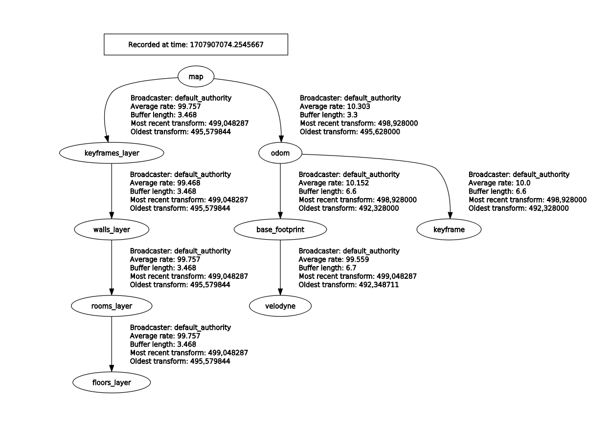

# 🤖 ROS Related

## 📥 Subscribed Topics 

### `s_graphs` node

| Topic name         | Message Type                                                                                        | Description                              |
| ------------------ | --------------------------------------------------------------------------------------------------- | ---------------------------------------- |
| `/odom`            | [nav_msgs/Odometry](http://docs.ros.org/en/noetic/api/nav_msgs/html/msg/Odometry.html)              | The odometry from the robot.             |
| `/filtered_points` | [sensor_msgs/PointCloud2](http://docs.ros.org/en/melodic/api/sensor_msgs/html/msg/PointCloud2.html) | The filtered data from the LiDAR sensor. |

### `room_segmentation` node

| Topic name                           | Message Type                                                                                                     | Description                                                                             |
| ------------------------------------ | ---------------------------------------------------------------------------------------------------------------- | --------------------------------------------------------------------------------------- |
| `/s_graphs/map_planes`               | [s_graphs/PlanesData](https://github.com/snt-arg/s_graphs/blob/feature/ros2/msg/PlaneData.msg)                   | Planes seen by the current robot keyframe.                                              |

### `floor_plan` node

| Topic name                 | Message Type                                                                                                     | Description                                      |
| -------------------------- | ---------------------------------------------------------------------------------------------------------------- | ------------------------------------------------ |
| `/s_graphs/all_map_planes` | [visualization_msgs/MarkerArray](http://docs.ros.org/en/noetic/api/visualization_msgs/html/msg/MarkerArray.html) | All the planes that have been seen by the robot. |

## 📤 Published Topics 

### `s_graphs` node

| Topic name                      | Message Type                                                                                                     | Description                                                                   |
| ------------------------------- | ---------------------------------------------------------------------------------------------------------------- | ----------------------------------------------------------------------------- |
| `/s_graphs/markers`             | [visualization_msgs/MarkerArray](http://docs.ros.org/en/noetic/api/visualization_msgs/html/msg/MarkerArray.html) | These markers represent the different s_graphs layers.                        |
| `/s_graphs/odom2map`            | [geometry_msgs/TransformStamped](http://docs.ros.org/en/api/geometry_msgs/html/msg/TransformStamped.html)        | The estimated drift of the robot within its map frame (world).                |
| `/s_graphs/odom_pose_corrected` | [geometry_msgs/PoseStamped](http://docs.ros.org/en/noetic/api/geometry_msgs/html/msg/PoseStamped.html)           | The optimized/drift-free pose of the robot once odom2map is applied.          |
| `/s_graphs/odom_path_corrected` | [nav_msgs/Path](http://docs.ros.org/en/noetic/api/nav_msgs/html/msg/Path.html)                                   | The optimized/drift-free pose path of the robot once the odom2map is applied. |
| `/s_graphs/map_points`          | [sensor_msgs/PointCloud2](http://docs.ros.org/en/melodic/api/sensor_msgs/html/msg/PointCloud2.html)              | The projected 3D points using the optimized robot pose.                       |
| `/s_graphs/map_planes`          | [s_graphs/PlanesData](https://github.com/snt-arg/s_graphs/blob/feature/ros2/msg/PlanesData.msg)                  | Planes seen by the current robot keyframe.                                    |
| `/s_graphs/all_map_planes`      | [s_graphs/PlanesData](https://github.com/snt-arg/s_graphs/blob/feature/ros2/msg/PlanesData.msg)                  | All the planes that have been seen by the robot.                              |

### `room_segmentation` node

| Topic name                     | Message Type                                                                                  | Description                                                              |
| ------------------------------ | --------------------------------------------------------------------------------------------- | ------------------------------------------------------------------------ |
| `/room_segmentation/room_data` | [s_graphs/RoomsData](https://github.com/snt-arg/s_graphs/blob/feature/ros2/msg/RoomsData.msg) | Contains all the necessary information about the rooms on a given floor. |

### `floor_plan` node

| Topic name               | Message Type                                                                                 | Description                                              |
| ------------------------ | -------------------------------------------------------------------------------------------- | -------------------------------------------------------- |
| `/floor_plan/floor_data` | [s_graphs/RoomData](https://github.com/snt-arg/s_graphs/blob/feature/ros2/msg/RoomsData.msg) | Contains all the necessary information about each floor. |

## 🔄 ROS Services 

| Topic name       | Message Type                                                                                  | Description                                                                                    |
| ---------------- | --------------------------------------------------------------------------------------------- | ---------------------------------------------------------------------------------------------- |
| `/s_graphs/dump` | [s_graphs/DumpGraph](https://github.com/snt-arg/s_graphs/blob/feature/ros2/srv/DumpGraph.srv) | Save all the internal data (point clouds, floor coeffs, odoms, and pose graph) to a directory. |

| Topic name           | Message Type                                                                              | Description                              |
| -------------------- | ----------------------------------------------------------------------------------------- | ---------------------------------------- |
| `/s_graphs/save_map` | [s_graphs/SaveMap](https://github.com/snt-arg/s_graphs/blob/feature/ros2/srv/SaveMap.srv) | Save the generated 3D map as a PCD file. |

## ⚙️ ROS Parameters 

All the configurable parameters are listed in config folder as ros params.

## 🌐 Published TFs 

- `map2odom`: The transform published between the map frame and the odom frame after the corrections have been applied.

- The entire `tf_tree` for the virtual experiment can be seen in the figure below.

{align=center}
